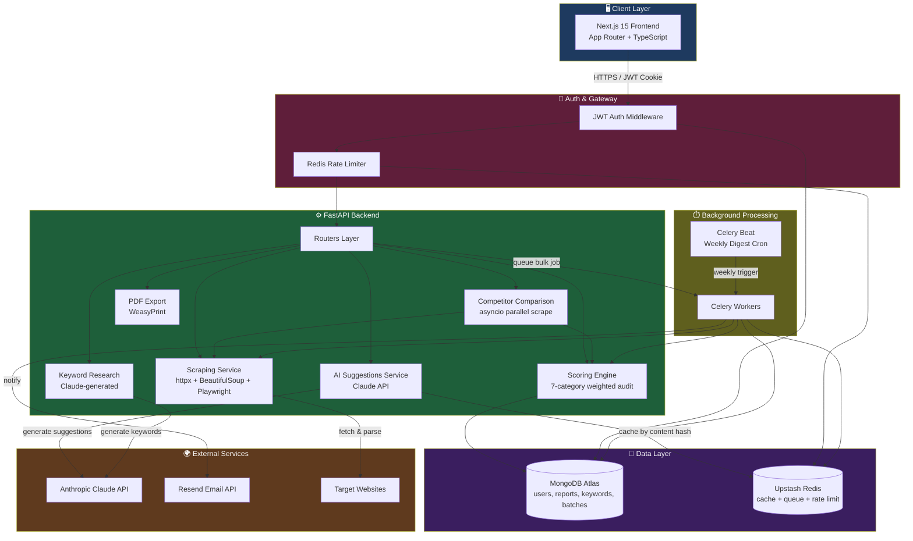
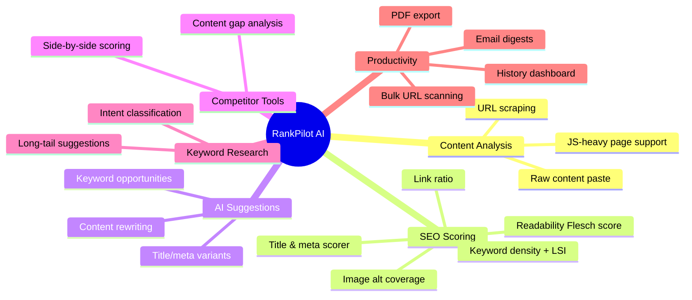
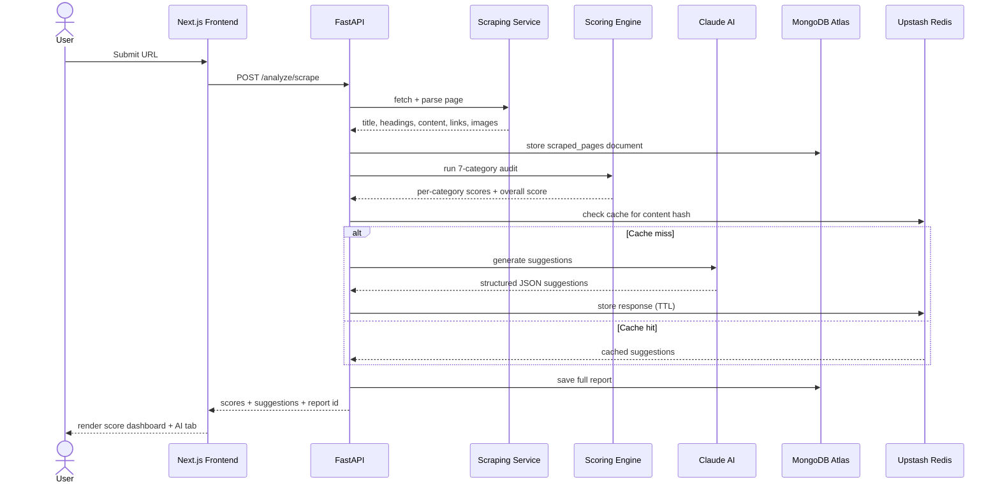
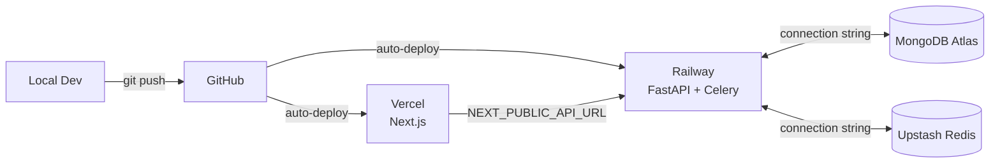

# 🚀 RankPilot AI

**AI-powered SEO content analysis platform**  scrape, score, compare, and optimize content using Claude AI, all from a single dashboard.

RankPilot AI combines the core workflows of tools like Ahrefs, SEMrush, Grammarly, and ChatGPT into one platform  built for bloggers, marketing agencies, and SaaS content teams who need fast, AI-assisted SEO audits without juggling five different subscriptions.

---

## 📖 Table of Contents

- [Overview](#-overview)
- [Architecture](#-architecture)
- [Tech Stack](#-tech-stack)
- [Core Features](#-core-features)
- [System Flow](#-system-flow)
- [Project Structure](#-project-structure)
- [Getting Started](#-getting-started)
- [Environment Variables](#-environment-variables)
- [API Overview](#-api-overview)
- [Deployment](#-deployment)
- [Contributing](#-contributing)

---

## 🌐 Overview

A user pastes a URL or raw content into RankPilot AI. The platform scrapes the page, runs it through a weighted 7-category SEO scoring engine, generates AI-powered rewrite suggestions via Claude, and stores the full report in the user's history all in a few seconds. Users can also compare their content against up to three competitors, run keyword research, batch-scan up to 20 URLs at once, and export polished PDF reports.

---

## 🏗️ Architecture



### Layer Breakdown

| Layer | Responsibility |
|---|---|
| **Client** | Next.js 15 (App Router) renders the dashboard, auth pages, and analysis forms; talks to the API over HTTPS using httpOnly cookies for tokens |
| **Edge** | JWT verification middleware + Redis-backed rate limiting protect every authenticated route |
| **API** | FastAPI routers delegate to focused service modules (scraper, scoring engine, AI suggestions, comparison, keyword research, PDF export) |
| **Async** | Celery workers handle bulk scans (up to 20 URLs/batch) and scheduled jobs via Celery Beat (weekly digest emails) |
| **Data** | MongoDB Atlas is the system of record; Upstash Redis handles caching, the Celery broker, and rate-limit counters |
| **External** | Claude API powers content suggestions and keyword generation; Resend sends transactional and digest emails |

---

## 🧰 Tech Stack

**Frontend**
- Next.js 15 (App Router, TypeScript, strict mode)
- Tailwind CSS + shadcn/ui
- Recharts (score & comparison visualizations)
- react-hook-form + zod (validation)
- sonner (toast notifications)

**Backend**
- FastAPI (Python 3.11, async)
- Motor (async MongoDB driver)
- Celery + Celery Beat (background jobs)
- WeasyPrint (PDF generation)
- httpx, BeautifulSoup, Playwright (scraping)

**Data & Infra**
- MongoDB Atlas (free M0 cluster)
- Upstash Redis (serverless, free tier)
- Anthropic Claude API (suggestions + keyword research)
- Resend (transactional email)
- Railway (backend hosting) + Vercel (frontend hosting)

---

## ✨ Core Features



---

## 🔄 System Flow — Single URL Analysis



---

## 📂 Project Structure

```
RankPilot_AI/
├── README.md
├── CONTRIBUTING.md
│
├── backend/
│   ├── app/
│   │   ├── core/
│   │   │   ├── config.py          # Pydantic settings (env vars)
│   │   │   ├── database.py        # MongoDB + Redis connections
│   │   │   ├── security.py        # JWT + password hashing
│   │   │   ├── deps.py            # auth dependencies
│   │   │   ├── limiter.py         # rate limiting
│   │   │   ├── celery_app.py      # Celery + Beat config
│   │   │   └── indexes.py         # MongoDB index creation
│   │   ├── models/                # user, scrape, score, keyword, etc.
│   │   ├── routers/                # auth, scrape, score, ai, competitor,
│   │   │                            keyword, dashboard, reports, bulk
│   │   ├── services/                # scraper, scoring_engine, ai_suggestions,
│   │   │                            competitor, keyword_service,
│   │   │                            pdf_generator, email
│   │   ├── tasks.py                # Celery tasks
│   │   └── main.py                 # FastAPI app entrypoint
│   ├── tests/
│   ├── Procfile
│   ├── railway.json
│   ├── requirements.txt
│   └── .env.example
│
└── frontend/
    ├── src/
    │   ├── app/                    # pages: landing, login, signup,
    │   │                            dashboard, keywords
    │   ├── components/             # UI components, score-dashboard,
    │   │                            ai-suggestions, competitor-*, bulk-scan
    │   ├── context/                # auth context
    │   └── lib/                    # utilities
    ├── vercel.json
    └── package.json
```

---

## ⚡ Getting Started

### Prerequisites
- Node.js 20+
- Python 3.11+
- A free [MongoDB Atlas](https://www.mongodb.com/cloud/atlas) cluster
- A free [Upstash Redis](https://upstash.com/) database
- An [Anthropic API key](https://console.anthropic.com/)
- A [Resend API key](https://resend.com/) (free tier: 3,000 emails/month)

### 1. Clone & install

```bash
git clone https://github.com/Danyal-Nadeem/RankPilot_AI-AI-powered-SEO-content-analyzer-.git
cd RankPilot_AI-AI-powered-SEO-content-analyzer-

# Backend
cd backend
python -m venv venv
source venv/bin/activate   # Windows: venv\Scripts\activate
pip install -r requirements.txt

# Frontend
cd ../frontend
npm install
```

### 2. Configure environment variables

Copy `.env.example` → `.env` in both `backend/` and `frontend/`, then fill in your credentials (see [Environment Variables](#-environment-variables) below).

### 3. Run locally

```bash
# Terminal 1 — backend
cd backend
uvicorn app.main:app --reload

# Terminal 2 — Celery worker
cd backend
celery -A app.core.celery_app worker --loglevel=info

# Terminal 3 — Celery beat (scheduled jobs)
cd backend
celery -A app.core.celery_app beat --loglevel=info

# Terminal 4 — frontend
cd frontend
npm run dev
```

Visit `http://localhost:3000`.

---

## 🔑 Environment Variables

**`backend/.env`**

| Variable | Description |
|---|---|
| `MONGODB_URI` | MongoDB Atlas connection string |
| `REDIS_URL` | Upstash Redis connection URL |
| `JWT_SECRET_KEY` | Secret for signing JWT tokens |
| `ANTHROPIC_API_KEY` | Claude API key |
| `RESEND_API_KEY` | Resend email API key |
| `CORS_ORIGINS` | Allowed frontend origin(s) |

**`frontend/.env.local`**

| Variable | Description |
|---|---|
| `NEXT_PUBLIC_API_URL` | Backend API base URL |

Full annotated examples are in `backend/.env.example` and `frontend/.env.example`.

---

## 📡 API Overview

Interactive docs are auto-generated by FastAPI and available at `/docs` once the backend is running.

| Group | Example Endpoints |
|---|---|
| **Auth** | `POST /auth/signup`, `POST /auth/login`, `GET /auth/me`, `POST /auth/refresh` |
| **Scraping** | `POST /analyze/scrape` |
| **Scoring** | `POST /analyze/score` |
| **AI Suggestions** | `POST /analyze/ai-suggestions` |
| **Comparison** | `POST /analyze/compare` |
| **Keyword Research** | `POST /keywords/research`, `GET /keywords/saved` |
| **Dashboard** | `GET /reports`, `GET /reports/{id}`, `DELETE /reports/{id}` |
| **PDF Export** | `GET /reports/{id}/export-pdf` |
| **Bulk Scan** | `POST /bulk/scan`, `GET /bulk/{job_id}/status` |

---

## 🚀 Deployment



1. **Backend → Railway**: connect the `backend/` directory, set environment variables, Railway auto-detects the `Procfile`.
2. **Frontend → Vercel**: import the `frontend/` directory, set `NEXT_PUBLIC_API_URL` to your Railway backend URL.
3. **Database & cache**: both MongoDB Atlas and Upstash Redis are cloud-hosted — no local containers needed for production either.

---

## 🤝 Contributing

See [CONTRIBUTING.md](./CONTRIBUTING.md) for commit conventions, branching strategy, and the PR checklist.

---

